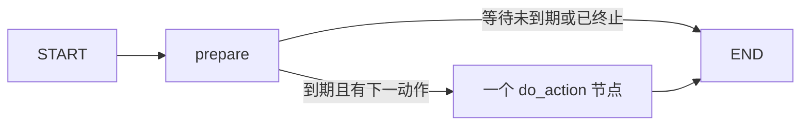

# LangGraph 编排节点与恢复契约

本文件描述 `agent_poc/orchestration/graph.py` 的实际第一步实现，图名为
`agent-single-experiment-v1`。完整字段、冻结规则、启动/恢复命令及配置说明见
[State 与运行入口契约](langgraph_state_contract.md)；这里集中说明节点、副作用和崩溃边界。

范围是同一 Session 的一次分类科学实验，服务端 `max_runs=1`。LLM 选择当前 Agent
能力与用户允许集合交集中的一个模型，随后根据安全 Validation 提出 Finalize。
编排器通过已有 Client/dispatcher 调用后端；没有训练器、Run Repository 或文件/SQL
业务工具入口。训练由后端 queued Run 和独立 worker 完成。

## 图与 runner 的职责

每次 `build_graph(dependencies, checkpointer)` 创建如下无环图：



`lifecycle.next_action` 选择下一个逻辑动作。一次 invoke 只执行 prepare 和至多一个动作
节点，动作节点保存下一动作后结束本次 tick。逻辑主路径为：

```text
capabilities → session → inspect_session → choose → submit → observe
    queued/running: 等待到期后再次 observe
    有效完成: finalize_decision → finalize → confirm → completed
    失败/取消/无有效指标: 明确无候选终止
    不确定提交或补偿: inspect_session / reconcile / needs_attention
```

LangGraph checkpoint 负责持久化，不负责定时唤醒。`runtime._drive` 根据保存的
`next_wake_at` 等待，`--wait` 下每次 sleep 不超过一秒，到期发起下一个 tick。
未指定 `--wait` 则在等待边界返回，下次 resume 继续。等待阶段不调用 LLM，也不会通过
增大图的 recursion limit 实现轮询。总 deadline 到期后，prepare/journal 调用检查拒绝
新的外部调用；已经运行的后端 Run 保留 queued/running 事实，不声称已取消 worker。

## 节点契约

表中“输出”表示逻辑 patch；实现先通过 `apply_patch` 校验并合并为完整 JSON State，
再返回 LangGraph。未修改字段继续保留。所有网络调用都经过同一个调用计量边界，六个
业务工具使用同一 dispatcher；恢复专用 reconcile 是 Client 的受控方法，不进入 LLM Schema。

| 节点 | 主要输入 | 输出 patch / 正常下一步 | 允许副作用与局部失败出口 |
|---|---|---|---|
| `prepare` | 当前 State、next_action、next_wake_at、deadline；call journal | 刷新 budget/usage/recovery attempts；构造或重放稳定 pending operation；必要时绑定 operation/request/experiment ID。截止时 timed_out；未知动作失败；未到唤醒时间直接 END | 读取本地 journal；不发起后端或 LLM 请求。返回后同步 checkpoint，给下一个动作建立持久化边界。原 State 版本/结构非法时失败关闭，不继续副作用 |
| `do_capabilities` | 用户 allowed_models；已准备的 inspect operation | 保存 Agent 模型、业务能力、模块快照及摘要；eligible_models 为用户集合和 Agent 模型集合交集；下一步 session | `inspect_ml_capabilities`。交集为空或后端不支持创建实验则 `no_available_model` 终止 |
| `do_session` | 完整固定 `SessionRequest`、session operation/request ID | 检查 locked_config 与 task/module_policy 一致，绑定 dataset SHA-256 与 session ID，读取后端 state/remaining_runs；下一步 inspect_session | `start_ml_session`。只在 Client HTTP 边界转换固定评估字段，恢复使用同 ID 和同内容。超时等待后重放；缺少可信 metadata 或冻结配置不匹配进入需核对出口 |
| `do_inspect_session` | session ID；已有提交内容、选中 Run；冻结 task | 回读 Session 与预算。已 finalized 则核对锁定；bound 实验绑定 execution 后 observe；reserved/compensation_required 则 reconcile；无实验时根据是否已有提交内容进入 submit 或 choose | `inspect_ml_session`。同 Session 超过一个实验违反第一步协议；released 明确终止；元数据、动作或数据指纹不一致失败关闭 |
| `do_choose` | task 白名单、eligible_models、编排器绑定的 session/request ID 和固定处理 | 保存经校验的 direct_action decision；保存完整 ExperimentRequest、submission request ID/摘要、experiment ID 与动作检查记录；下一步 submit | 一次真实 LLM `propose("submit", context)`。本节点只形成持久化提案，后续 submit 节点执行工具。只接受 submit 工具、当前绑定、交集模型和冻结处理；非法输出由有界修复处理，没有固定模型兜底 |
| `do_submit` | 已持久化 ExperimentRequest 与 experiment operation/request ID | 根据后端响应绑定唯一 run_id、effective action/config、数据指纹与 Run 状态；下一步 observe | `submit_ml_experiment`，仅创建 queued Run。返回动作必须等于提交决策，元数据必须 ready，数据 SHA-256 与 task 相同，feature selection 不得意外启用。提交响应不用于猜测剩余预算；稍后观察/Session 回读确认 |
| `do_observe` | 当前 session/run ID、选择指标、冻结执行内容 | 更新 execution/progress、预算与安全 feedback。queued/running 保存 next_wake_at 后等待；failed/cancelled 无候选终止；成功且 Validation ready、有指标且允许 finalize 时产生唯一候选及 post checks，再进入 finalize_decision | `observe_ml_experiment`。只读取六个 Validation 标量及安全状态。Manifest/指标不足不能成为候选；有限低分包括 0 不被当作无效。无候选理由为 `no_valid_candidate` |
| `do_finalize_decision` | task 白名单、唯一候选、已验证 Validation、后端允许动作、绑定的 session/selected Run | 保存经过校验的 finalize decision、候选 recommendation、selected_run_id 与简短理由，finalization 仍 pending；下一步 finalize | 一次真实 LLM `propose("finalize", context)`。要求工具名称和参数与绑定精确一致。模型不能增加候选、替换 Run 或读取人类结果页 |
| `do_finalize` | 稳定 FinalizeRequest、finalize operation ID、已持久化选择 | 先检查后端是否已锁定同一 Run；已锁定即确认结束；仍 open 则提交 Finalize，再进入 confirm | 顺序调用 `inspect_ml_session` 与必要的 `finalize_ml_session`。预先 inspect 使用同 operation 的 `-inspect` 计量 ID；两个实际网络调用分别计数。忽略 Finalize 返回的人类结果链接，只用后续 Session 回读确认 |
| `do_confirm` | session ID、已选 Run、冻结配置 | 回读 Session；仍 open 则回到 finalize；已 finalized 且选择一致则写 locked_at、confirmed、completed/END | `inspect_ml_session`。后端选中不同 Run 时 `backend_selection_conflict/needs_attention`，不修改本地选择以迁就响应 |
| `do_reconcile` | session ID、待核对状态、既有稳定提交内容 | 保存后端 resolution code、检查时间和对账结果。无项目或 bound 后 inspect_session；released 终止；要求人工核对则 needs_attention；reserved/compensation_required 等待后再次核对 | 仅 `reconcile_ml_session(session_id)`，HTTP body 固定空对象。后端决定 stale 门槛、释放/绑定/补偿，编排器不传 Run、reservation、owner 或时间阈值。未决时按当前 300 秒间隔等待，并受调用/尝试/总时限限制 |

## 统一的调用、异常与记录边界

`Nodes.call` 在发起 API 请求前调用 journal.begin；Graph 强制 Client `max_retries=0`，
避免 HTTP 客户端隐藏重试逃过持久化计数。API 单次 timeout 截断到冻结上限与当前剩余
总时限的较小值，调用后恢复配置上限。`Nodes.llm_call` 同样先记账，再调用适配器；
真实适配器接收剩余时限，格式修复不会更换原 operation ID。

`Nodes.execute` 是所有 do_action 节点的统一包装器：执行动作、把已知失败转为安全原因、
更新 pending operation 状态、重新投影 journal，再写稳定 history 事件。原始提供方文本、
HTTP 异常、SDK 异常链与完整响应不会进入 State。已知返回错误的调用也计入实际调用量；
begin 后没有 finish 的记录保留 unknown，不能因重启记成零。

| 异常 / 事实 | 路由与持久化含义 |
|---|---|
| `LLMError` | 按同 operation 的累计失败/实际尝试计数；未超修复上限则等待 1 秒重试相同阶段，超限 `llm_repair_exhausted`。中断未取得回复的调用仍占实际调用上限 |
| `agent_request_released` | 原科学尝试结束；不创建新 request ID 换取免费训练 |
| `agent_compensation_required` / `agent_active_run_exists` | 转受控 reconcile；不先提交第二个实验 |
| 可重试 HTTP 错误或连接/超时 | 等待 2 秒。submit 转 inspect_session 先查事实；finalize 转 confirm 先回读；其他动作恢复同阶段 |
| 非可重试 HTTP 错误 | 使用 Client 已限制的 code，needs_attention 并保留人工核对标记 |
| journal 限额或 deadline 错误 | 调用限额进入 needs_attention；deadline 进入 timed_out。拒绝新的外部请求，保留未知操作和已有 Run |
| API/State/提案契约错误 | `contract_validation_failed/needs_attention`，不继续提交或伪造成功 |
| 未分类动作执行错误 | `orchestration_internal_error/needs_attention`，不保存原始异常内容 |

检查点或 journal 物理存储不可用时，不能保证新终止状态能够落盘。运行入口报告安全
失败并关闭资源，恢复依据最后一个成功持久化的 checkpoint 和 journal 重新核验；不会
把未能记录的结果报告为已锁定成功。

history.event_id 从 durable journal 的调用 ID 派生；同 ID 同内容重放去重，逻辑 sequence
递增。history 保存节点/decision/operation/experiment/Run 引用及安全记录索引，完整
调用计量保留在 journal。一次 finalize 节点可顺序包含两次调用，它们均有独立 usage
记录；节点事件引用该节点最后一次调用，不把同一完整响应复制进多个状态块。

## 同步准备、调用 journal 与崩溃窗口

checkpoint 和调用 journal 使用两份独立的编排 SQLite 文件；它们不是一笔跨数据库原子
事务。实现通过“先完整准备并同步持久化，再提交调用意图，最后向外调用”使每个窗口
都可以解释。未知不会被转换成零消耗或业务成功。

| 崩溃位置 | 已有持久化事实 | 恢复方式 |
|---|---|---|
| prepare checkpoint 前 | 前一 tick 状态；尚无本次外部调用 | 重新准备相同逻辑步骤；POST 仍未发生 |
| prepare 已同步落盘、journal.begin 前 | 稳定 operation/request ID 与完整规范化内容；尚无本次调用记录 | `snapshot.next` 指向动作节点，runner 用 `invoke(None)` 继续；不重新获取已保存的 LLM 决策 |
| journal.begin 后、请求发出前 | 已预先计入的调用记录，状态 dispatched；请求是否实际发出未知 | 该尝试保守计入用量；同 operation 的下一尝试仍受原上限限制。不能把 begin 记录删除后免费重试 |
| 后端已提交、响应丢失 | 后端可能已有 Session、durable submission mapping/Run 或锁定；本地调用未确认 | Session 同 request/payload 重放；实验先 inspect/reconcile 或同键重放；Finalize 先 inspect，同 Run 才确认或重放 |
| journal.finish 已完成、动作 checkpoint 前 | journal 已知此次调用结果/usage，但 State 可能仍处于 prepared | 先从 journal 恢复计量；业务状态仍经后端回读/稳定重放确认，不能单凭一次调用成功标记猜造 Run 或锁定 |
| queued/running 等待 checkpoint 后 | 同 session/run、下一次唤醒时间、原 deadline | 新进程延续原时间与标识，到期观察；不消耗新模型选择调用，不创建新科学实验 |
| 后端 Finalize 已完成、本地锁定 checkpoint 前 | 服务端锁定已存在，本地 selected Run 已在更早节点保存 | 先 Session inspect；同一所选 Run 才写 confirmed/locked_at，不同选择进入需核对 |

科学实验 ID 与网络操作尝试数分开。CallJournal 用 `BEGIN IMMEDIATE` 检查当前 thread
该调用类别累计量和该 operation 已用尝试，再写 dispatched；结果完成后单独结算。
State 的 budget/recovery 是 journal 的可校验投影，不是另一份相互独立的计数权威来源。
第一步的 runs 则继续以后端 remaining_runs 为准。

## 单机执行者与恢复绑定

runner 对同一 thread 从读 checkpoint 到整个驱动退出持有 OS 文件锁，覆盖 start/resume。
status 不竞争执行锁；它用 mode=ro SQLite 读事务返回最新已提交的一致 checkpoint 快照，
不发请求、不执行 Graph、不改变 history 或用量。尚未 checkpoint 的在途动作不保证可见。
执行锁由 OS 持有，跨进程竞争立即拒绝；进程死亡后释放。它不是 Python
内存锁，也不宣称支持多机 HA。服务端 `max_runs=1` 的事务约束继续提供业务保护；这不
解决未来多个科学实验的全部并发调度问题。

resume 先校验完整 State/启动摘要，再核对 thread、规范化后端摘要、明确 principal
scope 与凭据的 HMAC 绑定、LLM 配置摘要、API timeout 摘要，以及当前 Prompt/投影/LLM
协议版本。全部匹配才创建运行依赖和继续调用；不接受 dataset、seed、模型集合、预算
或 Prompt/LLM 配置的静默替换。终态 next_action=null 时返回现有状态，不重新执行图。

本任务的 checkpoint、当前 history、未来跨任务案例 memory 具有不同职责。未来模块
在 State 中已完整分型，但在第一步始终 disabled/unavailable：没有 Train Evidence
统计、配方目录、知识匹配、案例召回/发布、搜索、科研 Guard、诊断、重规划、候选
不确定性或统一多维预算算法。当前 guard 只记录已有契约/动作/Manifest/选择指标检查。

## 验证入口与证据解释

相关测试按职责分布于：

- `agent_poc/tests/test_orchestration_state.py`：类型、冻结、稳定 ID、空态、未知计量与安全边界。
- `agent_poc/tests/test_orchestration_runtime.py`：SQLite/JSON、OS 锁、定时等待、配置绑定、只读 status 和新进程继续 pending 节点。
- `agent_poc/tests/test_graph.py`：节点选择、六工具路径、低分候选、失败/取消、修复/网络上限与 deadline。
- `agent_poc/tests/test_orchestration_integration.py`：合成分组数据、真实后端 API、独立 worker，以及不同提交/绑定/等待/锁定阶段杀死编排进程后恢复。
- `agent_poc/tests/test_llm.py` 与 Client 测试：真实 HTTP 适配代码的格式、协议、绑定和安全投影验证。

脚本化 provider 可验证 LLM HTTP 解析和真实后端链路，不能证明已访问用户服务器上部署
的大模型。实际模型服务、served model ID、协议、token usage、数据来源及一次跨进程
恢复的端到端验收必须另有真实联调记录；测试通过不代替该记录。
